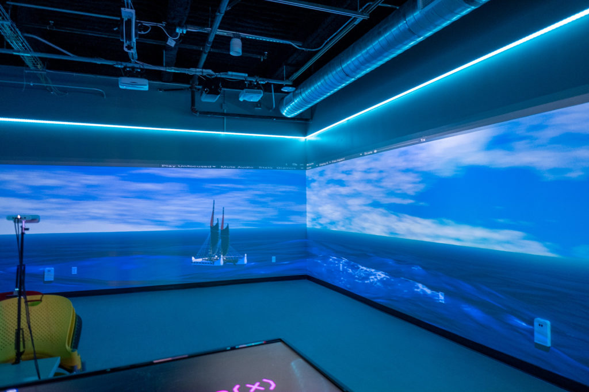

## Brief Overview

As per usual, if you want a TL;DR: here it is!

Learning Unity both from just a visual experience to a VR-interaction-based game, forced me to learn C# and a whole lot of other engine-specific things.

## What even is Unity? World Peace?

The Unity engine is a development platform for making just about any experience you want: 3D, 2D, games, experiences, apps, etc. The Unity engine supports building to PC, mobile, console, and extended reality. So in essence: the world is mine to explore learning this engine. 

The Unity engine also runs off of C#, and any code written for it must also be in C#. The code written for your projects, also known as scripts, interact with the engine's built in environment of GameObjects. GameObjects initially only have a Transform that describes their position, rotation, and scale. However, GameComponents can have components that are essentially give life to these transforms: renderers to give it a look or shape, physics engine properties, behavior scripts, etc. This doesn't even include the particle and effect systems that are built-in or make yourself. 

As a development platform, Unity is famous for so many games and other things that the recent controversy surrounding the platform comes as no surprise: as the community has relied on its shoulders for the longest time.

## So what did I even learn?

The first ***successful*** project in Unity I did was with a group: to develop an experience for an indoor real life space. The indoor space provided was the [CreateX](https://www.lavaflow.info/createx) lab under the Laboratory for Advanced Visualization & Applications (LAVA).

>Here are the two links to learn more about LAVA:
>> [Manoa's Academy of Creative Media's Page on LAVA](https://acmsystem.hawaii.edu/lava-lab/)
>
>> [LAVA's Site](https://www.lavaflow.info)

*An example of the displays at CreateX*

If you want to see the experience that we created as a group, you can see a demo video and the unity package [here](https://drive.google.com/drive/folders/1nvHqXi_w_vDd5SDY8YxfFI7qFILqMb_-).

Through that, I got the true basics of dealing with GameObjects and basic scripts by creating an environment and adding moving parts. This, in turn, was a good way to see the artistic potential and the low barrier to entry that Unity is. As a team, Unity is perfect as a ground to practice issue based project management, as everyone can instantly see what is going on just by pressing the "run" button. 

> *"Oh why is that glitching through?"*
> 
> **Or**
> 
> *"Oh. That is not rendering."*

You put into practice a lot of the problem-solving and project-management skills when making something. And I learned that the hard way when I went in blind in middle school to make a game, but absolutely didn't know how to code in C# or how to properly solve a problem. And, unsurprisingly, I gave up. So revisiting Unity with more experience was a fun time.

For my second Unity project, which you can see a more in-depth explanation about it [here](https://ravenmarq.github.io/projects/tank-command.html), I learned more about Component system and the true power of scripts. Here, on my blank canvas, I was given power to create whatever I could think of as long as I had the skill and drive to do so.

Taking the knowledge from all the ICS courses I had taken in my career as an aspiring programmer, I managed to create a demo of my first solo project. I am so happy with this basic demo, that I even plan to build atop it and make a more fleshed-out game (and I hope that I can one day update my projects tab to include it).

From virtual reality, physics engines, and frame updates, the manual and AI assistance were vital in holding my hand throughout the way. In time, I found myself I was learning the specifics of the C# language, the enums and functions of the Unity engine, and the quirks of the platform, I found myself working more and more efficiently than when I first started. Over the course of a semester, I went from not knowing C# and Unity to being confident enough to make a solo project. 

So for what's next, keep an eye out for me! Hell, maybe I make the next best-selling game!