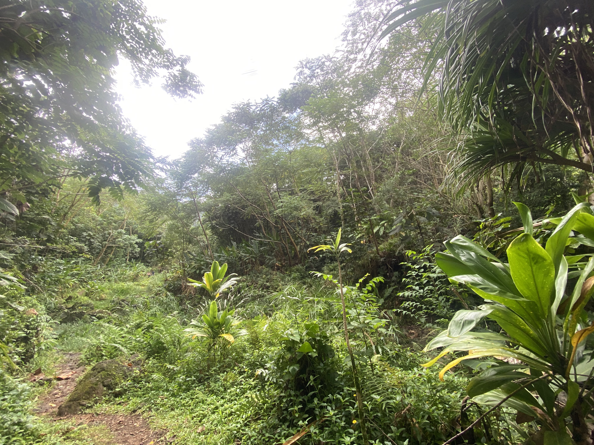

## About

From the MINA (Mālama I Nā Ahupuaʻa) program's experimental service learning site, under the College of Social Sciences at Mānoa:
> Organized by community partners, faculty and student leaders, MINA runs four semesters a year and welcomes **...** [individuals] and groups of all ages **...** to participate in its short-term programs or one-time activities.
>
>The program is built around a series of common core activities and optional specialization. Common core activities at the introductory level include opening and closing sessions, as well as an upland (heiau), a midland (lo’i) and a lowland (fishpond) activity
>> [Learn more here!]((https://socialsciences.manoa.hawaii.edu/study-at-css/experiential-learning/service-learning/mina/))

To be more specific, if you're not going into the program for a one-off event: participants put in a specific amount of work hours under the program, including the hours for the common core activities described by the program: the opening meeting of the program, the upland (heiau), the midland (lo’i), and the lowland (fishpond) activities, and the closing meeting of the program. 

## My Experience

In my case, I had to do 20 work hours, with the core activities fulfilling 14 of my 20 hours. Despite this, the service learning taught me a lot about the Hawaiian ecosystem and land management, all the while providing insight into Hawaiian issues and views on land and politics.

One example of such an insight is where we created a rock wall as a group:

This rock wall serves as a way to both functionally prevent runoff from the land it is walling off and as a natural way to show respect to the land and those who will come after us.

We also learned the history and the customs of respect towards heiau, like the one pictured below:

Being shrines to show respect to the gods, prayer and ceremonies are conducted around these to convene with ancestors and pay thanks to the land we live on. Many times, the activities will have a heiau that prayer, introductions, and closing is committed around. Each heiau has its own history and dedications, which the educators are more than willing to teach about.