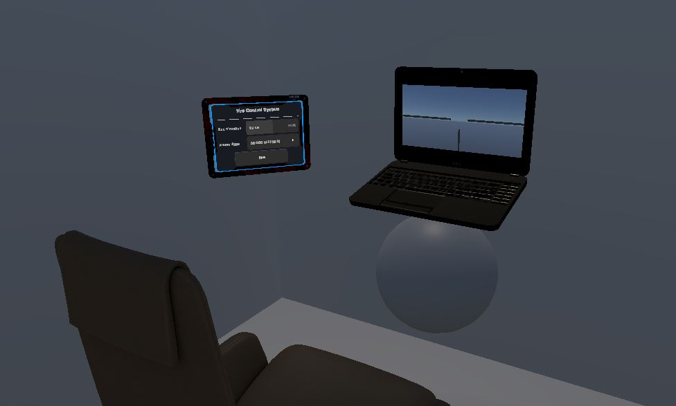

## Short Overview of My Experience

A solo project where I had to learn, essentially, Unity from scratch to create an experience including spatial audio and interactability. 

This project was a lot of fun and a learning experience in creating games for VR. In fact, this is the first game I ever made: and it should be fairly obvious I can't 3D-model for my life (judging from the sphere I used for the horizontal turret drive). 

From modifying sounds, implementing AI, movement, and essentially everything **BUT** modelling, I managed to create this by myself learning the engine.

The package is available for viewing and downloading, provided at the end of this page.

## Features

**Primitive AI pathing**: has its bugs and quirks, but works for the most part to keep the AI from slamming into the player's tank.

**Dynamic Audio**: Audio changes if you're inside the commander's seat or peeking out of the cupola.

**Interactability**: Using audio to locate enemies, grenades to throw (to both protect yourself and disable enemies), and a near-fully-adjustable commander's seat. 

**Gameplay**: Shoot enemy tanks! Using the two grenades and three shells, use them to defends and destroy enemy tanks!

>Below is the Unity package, demo video, and explanation of showcased details in said demo video:
>> [Link](https://drive.google.com/drive/folders/1CGsgBWofTsByxNPWiweFK2ZSEhVPm0Nd) (As of Dec. 10, 2023)